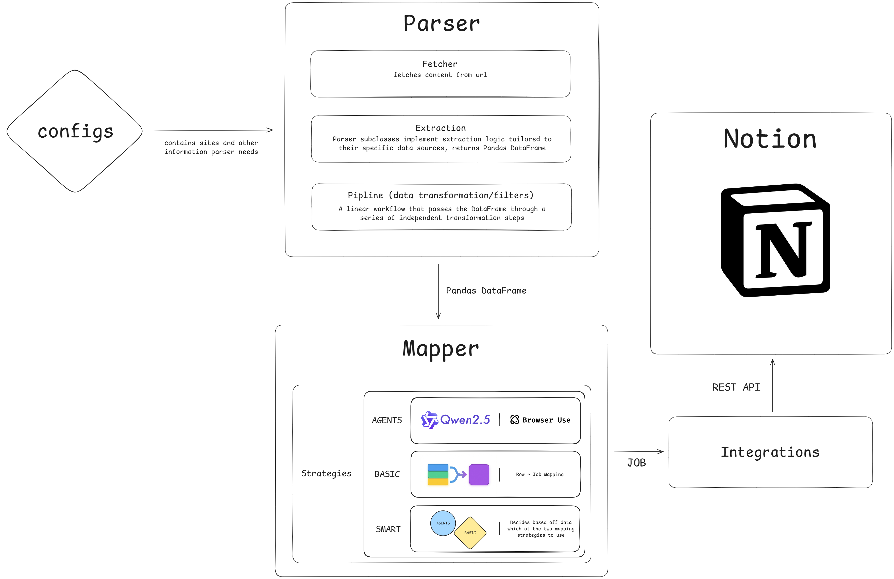

[![Contributors][contributors-shield]][contributors-url]
[![Forks][forks-shield]][forks-url]
[![Stargazers][stars-shield]][stars-url]
[![Issues][issues-shield]][issues-url]
[![MIT License][license-shield]][license-url]


[contributors-shield]: https://img.shields.io/github/contributors/DereckTav/Automated-Job-Board.svg?style=for-the-badge
[contributors-url]: https://github.com/DereckTav/Automated-Job-Board/graphs/contributors
[forks-shield]: https://img.shields.io/github/forks/DereckTav/Automated-Job-Board.svg?style=for-the-badge
[forks-url]: https://github.com/DereckTav/Automated-Job-Board/network/members
[stars-shield]: https://img.shields.io/github/stars/DereckTav/Automated-Job-Board.svg?style=for-the-badge
[stars-url]: https://github.com/DereckTav/Automated-Job-Board/stargazers
[issues-shield]: https://img.shields.io/github/issues/DereckTav/Automated-Job-Board.svg?style=for-the-badge
[issues-url]: https://github.com/DereckTav/Automated-Job-Board/issues
[license-shield]: https://img.shields.io/github/license/DereckTav/Automated-Job-Board.svg?style=for-the-badge
[license-url]: https://github.com/DereckTav/Automated-Job-Board/blob/master/LICENSE.txt

<!-- PROJECT LOGO -->
<br />
<div align="center">

<a href="https://github.com/DereckTav/Automated-Job-Board">
    
  </a>

<h3 align="center">
  💼 <a href="https://www.notion.so/Board-2c5048332b688003b602df306157a27b?source=copy_link">[NOT ACTIVE] AutoJobBoard</a>
</h3>

<p align="center">
    An automated job board that aggregates and displays the latest job postings from multiple sources
	<br />
    <br />
    <a href="https://github.com/DereckTav/Automated-Job-Board/issues/new?labels=bug&template=bug-report---.md">Report Bug</a>
    ·
    <a href="https://github.com/DereckTav/Automated-Job-Board/issues/new?labels=enhancement&template=feature-request---.md">Request Feature</a>
  </p>
</div>
---

# About Project

## Description
---
keeps track of new job openings without the need for manual searching by centralizing the employment hunt, automatically gathering new opportunities from multiple job boards. Helps maintain an efficient job search workflow, all through Notion.

    Key Features
    
    - Event-Driven & Scheduled Updates (3-24h)
    - 48-Hour Priority Window (5-day rolling history)


## architecture


## Table of Contents

---
- [Installation](#installation)
- [Configuration](#configuration)
- [websitesl.yaml setup](#instructions-for-setting-up-websitesyaml)
- [Usage](#usage)
- [Extra Info](#extra-info)


## Installation

---
Step-by-step instructions on how to get the project running locally:

```bash
# Clone the repository
git clone https://github.com/DereckTav/Automated-Job-Board.git

# Navigate to project directory
cd job-board-aggregator

# Create a virtual environment (recommended)
python -m venv venv

# Activate virtual environment
# On Windows:
venv\Scripts\activate

# On macOS/Linux:
source venv/bin/activate

# Install dependencies
pip install -r requirements.txt
```

## Configuration

---
Before running the script, ensure `websites.yaml` is created and properly configured with:
- Job board URLs
- Parsing instructions (selectors) for each site
- Any required selectors (`company_name`,`position`)

---
### Instructions for setting up websites.yaml

create file called `websites.yaml` at root

[test.yaml](test/test.yaml) provides a basic example of how to set up websites.yaml

`websites.yaml` contains the necessary configuration for job boards and their parsing instructions.

---
## Usage

---
### Basic Usage


The script runs via terminal/command line.

```bash
python main.py
```

Press `Ctrl+C` to stop

---
### Running 24/7 (Background Execution)

#### Docker

Docker provides consistent behavior across Windows, Mac, and Linux.

#### Commands:
```bash
# Start (builds if needed)
docker-compose up -d

# View logs
docker-compose logs -f

# Stop
docker-compose down

# Restart
docker-compose restart

# View status
docker-compose ps
```

## **EXTRA INFO**

---
All parsers except `download_parser` use `-relative` to signify that
the date that is being used is relative

meaning download_parser doesn't work with relative dates

Some sites may load content with react or JS, and for those sites I would recommend using `JS` in `websites.yaml`,
becuase sometimes it has Unicode `\u003`, which breaks `STATIC` parser.
